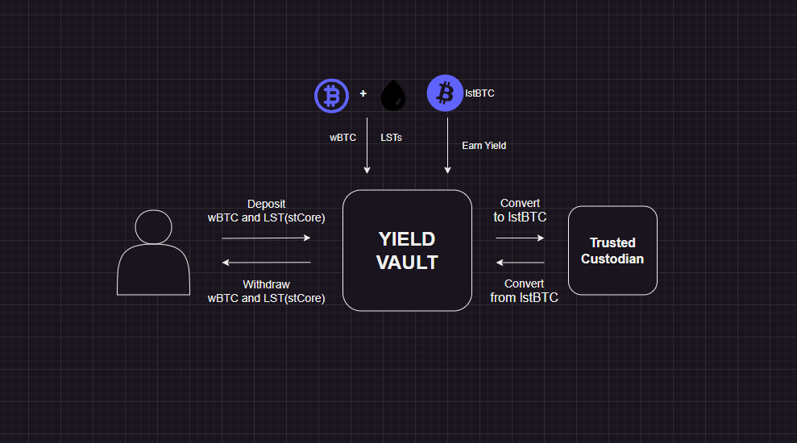

<p align="center">
  
</p>

<h1 align="center">Famz Yielding Protocol</h1>

> ⚠️ **WARNING**: This project is currently in **testnet phase**. All contracts and tokens are **simulated**. Do **not** deposit real funds.

---

## Table of Contents

1. [Status & Disclaimer](#status--disclaimer)
2. [Introduction](#introduction)
3. [Goals](#goals)
4. [Key Features](#key-features)
5. [How It Works](#how-it-works)
6. [Architecture](#architecture)
7. [Technical Stack](#technical-stack)
8. [Project Structure](#project-structure)
9. [Getting Started](#getting-started)
10. [Risk Considerations](#risk-considerations)
11. [Roles & Permissions](#roles--permissions)
12. [Use Cases](#use-cases)
13. [Contributing](#contributing)
14. [License](#license)
15. [Contact](#contact)

---

## Status & Disclaimer

- 🧪 **Phase**: Testnet (Development)
- 📅 **Target Mainnet Launch**: Soon
- 🔐 **Audit Status**: In progress
- ⚠️ **Not for real funds** — this is a **simulation** for testing and demonstration.

This protocol is under active development. The smart contracts, tokenomics, and architecture are subject to change.

---

## Introduction

**Famz Yield** is a decentralized yield vault deployed on the **CORE Blockchain** that enables users to deposit **Wrapped Bitcoin (wBTC)** and **Liquid Staking Tokens (LSTs)** — such as **stCORE** — and receive a single, yield-bearing token: **lstBTC**.

The protocol combines **BTC exposure** with **staking yield**, allowing users to earn passive income while maintaining full liquidity and the ability to redeem their original assets at any time.

By leveraging a **custodian-based model** and on-chain smart contracts, Famz Yield ensures **security, transparency, and efficiency** in asset management.

---

## Goals

- Provide a seamless **BTC-based yield** mechanism on the CORE blockchain.
- Allow users to deposit **wBTC and LSTs** and receive a unified **lstBTC** token.
- Maintain **liquidity** while earning staking rewards.
- Ensure **secure and transparent** asset conversion via a trusted custodian.
- Enable **flexible redemption** of lstBTC into original asset mix.

---

## Key Features

1. **Wrapped BTC and LST Integration**  
   Users deposit wBTC and whitelisted LST tokens into the vault, which are converted into **lstBTC** based on BTC-equivalent value.

2. **Yield Generation**  
   Deposited assets generate yield, reflected as **increased lstBTC balances** through proportional distribution.

3. **Custodian-Based Conversion**  
   All assets are securely held by the `Custodian.sol` contract, ensuring transparency and reducing smart contract risk.

4. **Liquidity and Flexibility**  
   Users can **redeem lstBTC at any time** for the original wBTC and stCORE in their deposit ratio.

5. **Enhanced Yield Efficiency**  
   Combines BTC price exposure with staking rewards from LSTs for optimal yield without compromising liquidity.

---

## How It Works

### 1. Deposit

- User approves `wBTC` and `stCORE` for spending.
- Calls `VaultNew.deposit()` with amounts.
- Assets are transferred to `Custodian.sol` for secure storage.
- `lstBTC` is minted 1:1 with BTC value (via `PriceOracle`).

### 2. Yield Generation

- The **operator** earns yield on assets (e.g., via lending or staking).
- Operator transfers earned `wBTC` to the vault.
- Operator calls `VaultNew.notifyYield(amount)` to trigger distribution.
- Vault mints new `lstBTC` and distributes it **proportionally** to all holders.

### 3. Redemption

- User burns `lstBTC` via `redeem()`.
- `Custodian` calculates original deposit ratio (wBTC/stCORE).
- Underlying assets are returned to the user.

### 4. Security

- All assets are held by `Custodian.sol`.
- Only authorized contracts can mint/burn `lstBTC`.
- Oracle prices ensure fair BTC-equivalent valuation.

---

## Architecture



### Core Components:

- **`VaultNew.sol`**: User-facing contract for deposits, redemptions, and yield distribution.
- **`Custodian.sol`**: Securely stores assets and manages deposit ratios.
- **`LstBTCNew.sol`**: ERC-20 token representing yield-bearing BTC (1 lstBTC = 1 BTC value).
- **`PriceOracle.sol`**: Provides real-time price data for `stCORE/CORE` and `CORE/BTC`.
- **`VaultMath.sol`**: Pure library for BTC-value and ratio calculations.

---

## Technical Stack

- **Blockchain**: CORE Blockchain (EVM-compatible)
- **Languages**: Solidity (smart contracts), TypeScript/JavaScript (frontend & scripts)
- **Frameworks**: Hardhat (testing/deployment), React (frontend)
- **Libraries**: OpenZeppelin (security, ERC20), Chai (testing), Ethers.js
- **Styling**: TailwindCSS, Shadcn/ui
- **State Management**: React Context API
- **Navigation**: React Router
- **Oracles**: Custom `PriceOracle` with Chainlink-style interface

---

## Project Structure

```
famz-vault/
├── hardhat/ # Smart contracts and Hardhat setup
│ ├── contracts/ # Solidity contracts (Vault, Custodian, etc.)
│ ├── scripts/ # Deployment and utility scripts
│ ├── test/ # Hardhat test suite
│ ├── artifacts/ # Compiled contract data
│ └── hardhat.config.ts # Hardhat configuration
│
├── client/                       # Frontend application
│ ├── public/                     # Static assets
│ │   ├── favicon.ico
│ │   ├── placeholder.svg
│ │   └── robots.txt
│ │
│ ├── src/
│ │   ├── components/              # Reusable UI components
│ │   │   ├── DepositModal.tsx
│ │   │   ├── EarningsCard.tsx
│ │   │   ├── Navigation.tsx
│ │   │   ├── ProtectedRoute.tsx
│ │   │   ├── ThemeToggle.tsx
│ │   │   ├── UserPositions.tsx
│ │   │   ├── VaultCreationCard.tsx
│ │   │   ├── VaultDepositModal.tsx
│ │   │   ├── WalletConnect.tsx
│ │   │   ├── icons/
│ │   │   └── ui/                  # Shadcn/ui components
│ │   │
│ │   ├── config/
│ │   │   └── wagmi.ts             # Wagmi + RainbowKit config
│ │   │
│ │   ├── contexts/                # State management
│ │   │   ├── ThemeContext.tsx     # Dark/light mode
│ │   │   └── VaultContext.tsx     # Vault state, user positions
│ │   │
│ │   ├── hooks/
│ │   │   ├── use-mobile.tsx       # Mobile detection
│ │   │   ├── use-toast.ts         # Toast notifications
│ │   │   └── useWalletConnection.ts # Wallet connect logic
│ │   │
│ │   ├── lib/
│ │   │   ├── secureStorage.ts     # Local storage wrapper
│ │   │   └── utils.ts             # Helpers (formatting, math)
│ │   │
│ │   ├── pages/                   # Route components
│ │   │   ├── Dashboard.tsx
│ │   │   ├── Index.tsx
│ │   │   ├── Landing.tsx
│ │   │   ├── NotFound.tsx
│ │   │   └── Vaults.tsx
│ │   │
│ │   ├── App.css
│ │   ├── App.tsx
│ │   ├── index.css
│ │   ├── main.tsx
│ │   └── vite-env.d.ts
│ │
│ ├── index.html
│ ├── package.json
│ ├── tsconfig.json
│ ├── tsconfig.app.json
│ ├── tsconfig.node.json
│ ├── vite.config.ts
│ ├── tailwind.config.ts
│ ├── postcss.config.js
│ ├── eslint.config.js
│ ├── components.json
│ └── bun.lockb (or package-lock.json)
│
├── docs/ # Documentation (optional)
│ └── logo.png
│
└── README.md
```

---

## Getting Started

### Prerequisites

- Node.js >= 16.x
- npm or yarn
- Hardhat CLI
- Wallet with CORE testnet tokens

### Installation

- git clone https://github.com/alade-dev/famz-vault.git
- cd famz-vault
- cd client
- npm install

### Compile & Test

```bash
# From root (famz-vault/hardhat)
npx hardhat compile
npx hardhat test
```

### Deployment

```bash
npx hardhat run scripts/deploy.js --network coretestnet
```

Ensure your `.env` file contains:

```env
PRIVATE_KEY=your_private_key_here
CORE_TESTNET_RPC_URL=https://rpc.test2.btcs.network/
CORE_SCAN_API_KEY=xxxxxxxxx
```

---

## Risk Considerations

- **Custodial Risk**: The `Custodian` contract holds all deposited assets. While code is open-source, it relies on a **trusted operator** for yield injection.
- **Oracle Risk**: BTC price feeds are critical for valuation. If compromised, redemption values may be incorrect.
- **Smart Contract Risk**: This project has not yet been audited by a third party.
- **Operator Risk**: Yield distribution depends on a single operator. Future versions will decentralize this role.
- **Testnet Warning**: All tokens (wBTC, lstBTC) are mock/mintable. This is not mainnet.
- **Upgradeability**: Current contracts are **not upgradeable** — future versions may use UUPS proxies.

---

## Roles & Permissions

| Role         | Permissions                                                 |
| ------------ | ----------------------------------------------------------- |
| **Owner**    | Can set operator, fee receiver, whitelist LSTs, pause vault |
| **Operator** | Can call `notifyYield()` and distribute yield               |
| **Vault**    | Authorized minter and burner of `lstBTC`                    |
| **Users**    | Can deposit, redeem, and view balances                      |

Access is strictly enforced via `onlyOwner`, `onlyOperator`, and `onlyMinter` modifiers.

---

## Use Cases

- **BTC Holders**: Earn yield on idle wBTC while maintaining BTC price exposure.
- **LST Holders**: Combine staking rewards with BTC liquidity strategies.
- **DeFi Platforms**: Use `lstBTC` as a collateralized, yield-bearing asset.
- **Liquidity Providers**: Bridge BTC and staked assets into a single token for yield farming.

---

## Contributing

We welcome contributions! Please follow these steps:

1. Fork the repository
2. Create a feature branch (`git checkout -b feature/your-feature`)
3. Commit your changes
4. Push to the branch
5. Open a Pull Request

Ensure:

- All tests pass (`npx hardhat test`)
- Code is well-documented
- NatSpec comments are added for new functions
- No console logs in production code

See [CONTRIBUTING](./hardhat/CONTRIBUTING.md) for more details.

---

## License

MIT License. See [LICENSE](./hardhat/LICENSE) for full terms.

---

## Contact

- **Twitter**: [@famz_yield](https://x.com/famz_yield)

> 🔒 For security reports, please use a secure channel.

---

> Built with ❤️ by the Famz Team
