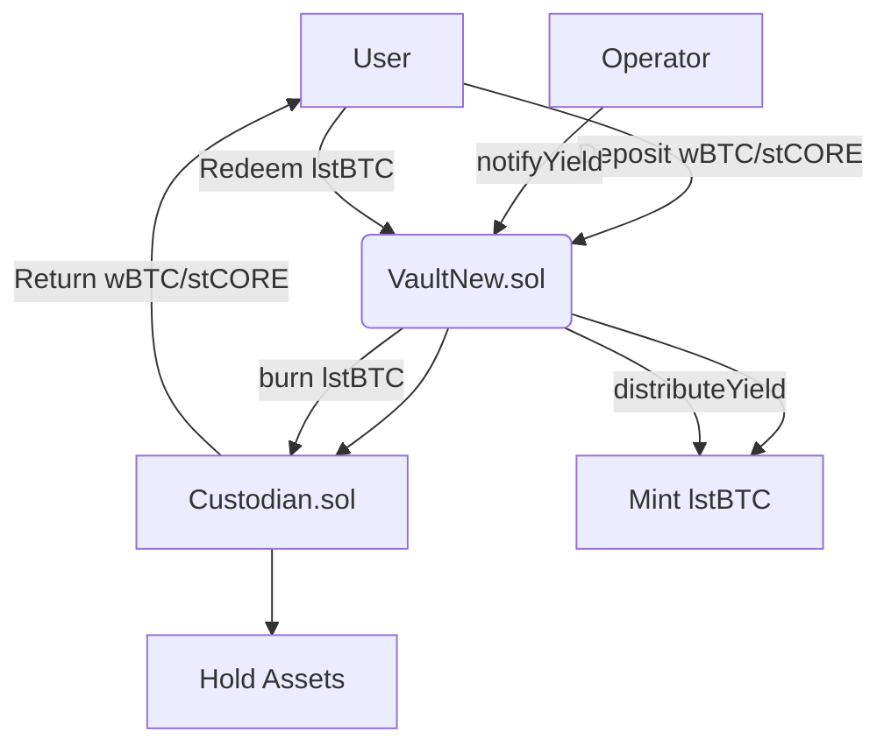

# System Architecture

The Famz Yield system is built around a **custodian-based model** to ensure security and transparency.

```mermaid
graph TD
    A[User] -->|Deposit wBTC/stCORE| B(VaultNew.sol)
    B --> C[Custodian.sol]
    C --> D[Hold Assets]
    B --> E[Mint lstBTC]
    F[Operator] -->|notifyYield| B
    B -->|distributeYield| E
    A -->|Redeem lstBTC| B
    B -->|burn lstBTC| C
    C -->|Return wBTC/stCORE| A
```
