# System Architecture

The Famz Yield system is built around a **custodian-based model** to ensure security, fairness, and transparency in yield distribution.

## Key Design Features

- **Epoch-based operations**:

  - The system operates in fixed 24-hour rounds (“epochs”).
  - All deposits and redemption requests are processed only at epoch boundaries.
  - Yield distribution happens only once per epoch, simplifying accounting.

- **Dual-asset support**:

  - Supports both `wBTC` and `stCORE` deposits.
  - Tracks yields for each asset type separately.
  - Distributes yield proportionally based on each depositor’s asset ratio.

- **Operator-driven yield injection**:

  - A designated operator closes epochs, injects yield (wBTC, stCORE, or both), and triggers distribution.
  - Yield injection can be from off-chain strategies, staking rewards, or protocol revenue.

- **BTC-equivalent accounting**:
  - The system uses an on-chain `PriceOracle` to convert stCORE and CORE values into BTC-equivalent terms.
  - This ensures fair and transparent conversion for deposits, redemptions, and yield.

---

## Updated Architecture Diagram

```mermaid
graph TD
    A[User] -->|Deposit wBTC/stCORE| B(Vault.sol)
    B --> C[Custodian.sol]
    C --> D[Secure Asset Storage]
    B -->|Mint lstBTC (BTC-equivalent)| E[LstBTCNew.sol]

    %% Epoch Flow
    subgraph Epoch Cycle [24h Epoch Cycle]
        F[Operator] -->|Close Epoch| B
        F -->|Inject Yield (wBTC/stCORE)| C
        B -->|Calculate Per-Asset Yield| G[Distribution Logic]
        G -->|Mint Yield lstBTC| E
    end

    %% Redemption
    A -->|Request Redemption| B
    B -->|Burn lstBTC| E
    B -->|Process Redemption at Epoch Close| C
    C -->|Return wBTC/stCORE| A
```

---

## Epoch Timeline

The following timeline shows how deposits, yield injection, and redemptions are handled during a 24-hour epoch.

```mermaid
gantt
    dateFormat  HH:mm
    axisFormat  %H:%M
    title Daily Epoch Cycle (24h)
    section Deposit Window
    Users Deposit Funds   :done, 00:00, 20:00
    section Operator Actions
    Close Epoch           :milestone, 20:00, 0min
    Inject Yield          :active, 20:01, 1h
    Distribute Yield      :active, 21:01, 1h
    section Redemption Processing
    Process Redemption Requests :done, 22:00, 2h
```



---

## Operational Flow

1. **Deposit Phase**

   - Users deposit wBTC, stCORE, or both.
   - Deposits are locked until the next epoch close.
   - Vault calculates BTC-equivalent value and mints lstBTC.

2. **Epoch Close (24h)**

   - Operator closes the epoch.
   - Operator injects yield into custodian storage.
   - Vault calculates per-asset yield distribution and mints new lstBTC to depositors.

3. **Redemption Phase**

   - Users request redemption of lstBTC.
   - Redemptions are processed at the next epoch close.
   - Custodian returns proportional wBTC and/or stCORE to the user.

---

## Security Considerations

- **Custodian isolation**: Assets are stored in `Custodian.sol` to reduce vault attack surface.
- **Operator restrictions**: Only the operator can close epochs and inject yield.
- **Minimum transaction limits**: Prevents dust attacks and unnecessary gas use.
